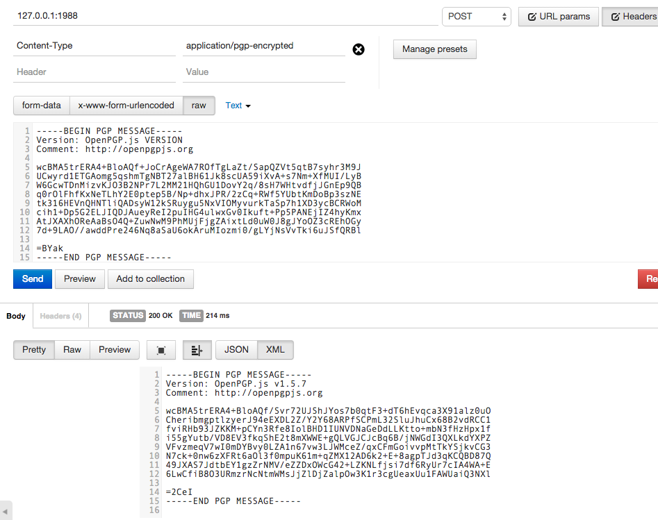

# koa-pgp
  Pretty good middlware privacy

[](https://nodei.co/npm/koa-pgp/) [](https://nodei.co/npm/koa-pgp/)


    npm install koa-pgp

## dependencies

    npm install koa-bodyparser-secure

## Basic Middleware Example
 - Requires a content-type of application/pgp-encrypted with koa-bodyparser-secure installed

 


## Basic Example
```js

'use strict';
const APP  = require('koa');
let fs     = require('fs');
let koaPGP = require('koa-pgp');
let parser = require('koa-bodyparser-secure');

APP.use(parser());

APP.use(function *(next) {
  this.request.body = ':: koa-pgp: starting example ::';
  console.log(this.request.body);
  yield next;
});


let createFile = function (file_name, data) {
  return new Promise( function (resolve,reject) {
    let file_path = './example_files/' + file_name;
    fs.writeFile(file_path, data, function (err) {
      if (err) {
        resolve(false);
        return console.log(err);
      } else {
        console.log('Writing file ' + file_path);
        resolve(true);
      }
    });
  });
};

let readFile = function (file_path) {
  return new Promise( function (resolve, reject) {
    fs.readFile(file_path, 'utf8', function (err, data) {
      if (err) {
        throw err;
        resolve(false);
      } else {
        resolve(data);
      }
    });
  });
};


APP.use(function *(next) {
  console.log('running next step in co-flow');

  let ctx  = this;

  //instantiate the inheritence of openpgp.js

  ctx._pgp = ctx._pgp ? ctx._pgp : yield koaPGP.init;

  //options argument for openpgp.js https://github.com/openpgpjs/openpgpjs
  let options = {
    numBits: 2048,
    userId: 'Jon Smith <jon.smith@example.org>',
    passphrase: secret
  };

  //create the keys
  let keys         = yield koaPGP.createKeys(this._pgp, options);
  //console.log(keys);
  let private_key  = keys.private_key;
  let public_key   = keys.public_key;

  // Write files to local example_keys directory
  let createPKFile = yield createFile('private.key', private_key);
  let createPubFile = yield createFile('pub.key', public_key);

  // Passing into scope to show example
  // ctx.public_key   = public_key;
  // ctx.private_key  = private_key;
  // ctx.passphrase   = options.passphrase;

  //encrypt the message
  let message      = yield koaPGP.encrypt(ctx, ctx.request.body, private_key);
  let createMsg    = yield createFile('example.msg', message);
  //setting the body to the encrypted message

  yield next;
});


APP.use(function *(next) {
  let ctx               = this;
  let encrypted_message = yield readFile('./example_files/example.msg');
  ctx.request.body      = encrypted_message;

  console.log();
  console.log();
  console.log('-----------------------ENCRYPTED MESSAGE--------------------');
  console.log(ctx.request.body);
  console.log('-----------------------ENCRYPTED MESSAGE--------------------');
  console.log();
  console.log();

  yield next;
});


APP.use(function *(next) {
  let ctx     = this;
  ctx._pgp    = ctx._pgp ? ctx._pgp : yield koaPGP.init;
  let pk      = yield readFile('./example_files/private.key');
  let message = yield koaPGP.decrypt(ctx, ctx.request.body, pk, secret);

  //setting the body to the decrypted message

  ctx.request.body = message;
  console.log();
  console.log();
  console.log('-----------------------DECRYPTED MESSAGE--------------------');
  console.log(ctx.request.body);
  console.log('-----------------------DECRYPTED MESSAGE--------------------');
  console.log();
  console.log();


  yield next;
});

APP.use(function *(next) {
  //the decrypted body after the public key has been passed.
  this.response.status = 200;
  this.response.body   = this.request.body;
  yield next;
});

APP.listen(1988);

```
## As Basic Middleware
```js
'use strict';
const CONFIG     = require('./config');

let fs           = require('fs');
let secureParser = require('koa-bodyparser-secure');

module.exports = function (app, koaPGP){
  fs.readFile('./example_files/private.key', 'utf8', function(err, privkey) {
    if (err) {
      throw err;
    } else {
      fs.readFile('./example_files/pub.key', 'utf8', function(err, pubkey) {
        if (err) {
          throw err;
        } else {
          // Header required of application/pgp-encrypted
          app.use(secureParser());
          app.use(koaPGP.middleware(privkey, config.secret));

          app.use(function *(next) {
            console.log(this.request.body);
            yield next;
          });

          let injection    = {};
          injection.status = 200;
          app.use(koaPGP.middleware_out(pubkey, injection))
          app.listen(1988);
        }
      });

    }
  });
};
```

## Advance Middleware
```js
'use strict';

const CONFIG     = require('./config');

let fs           = require('fs');
let secureParser = require('koa-bodyparser-secure');


// requires a content-type of application/pgp-encrypted

module.exports = function (APP, koaPGP) {
  let retrievePrivateKey = function () {
    return new Promise(function (resolve, reject) {
      try {
        fs.readFile('./example_files/server_example_pk.key', 'utf8', function (err, privkey) {
          if (err) {
            throw err;
          } else {
            resolve(privkey);
          }
        });
      } catch (err) {
        console.error(err.stack);
        resolve(false);
      }
    });
  };

  // Header Content-Type required of application/pgp-encrypted
  // Header PGP-Identifier required

  APP.use( secureParser() );
  APP.use(function *(next) {

    let ctx              = this;
    ctx._pgp             = ctx._pgp             ? ctx._pgp             : yield koaPGP.init;
    ctx._pgp._privateKey = ctx._pgp._privateKey ? ctx._pgp._privateKey : yield retrievePrivateKey();
    ctx._pgp._passphrase = ctx._pgp._passphrase ? ctx._pgp._passphrase : CONFIG.secret;

    yield next;
  });

  APP.use ( koaPGP.middleware_lookup_pubkey() ); // Lookups up the key with a designated key server; it's default is set to pgp.mit.edu
  APP.use( koaPGP.middleware() );

  APP.use(function *(next) {
    console.log('decrypted body:', this.request.body);
    this.response.body = { message: 'super secret, wow', code: 200, success: true };
    console.log('secret reply:', this.response.body);
    yield next;
  });

  let injection    = {};
  injection.status = 200;

  APP.use( koaPGP.middleware_out(null, injection) );

  APP.listen(CONFIG.port);

  console.log('Starting Koa-PGP Middleware example on port:', CONFIG.port);

};

```

## Further Examples
   See example.js -- injection arguments will soon be added


## Functions
  [middleware](#middleware)

  - middleware(private_key, passphrase, injection)
  - middleware_out(public_key, injection)
  - middleware_lookup_pubkey(options, promiseFunction)
    - options: header_key, hkp_server
    - Defaults hkp_server to lookup Public Key at pgp.mit.edu
    - Defaults header_key to 'PGP-Identifier' as header parameter expected
  - middleware_injection(promiseFunction)

*Want to contribute to this repository? Submit a pull request!*

### What's still needed?
  - Unit Tests
  - A standard to convert PGP messsages to JSON

## Full Examples
  - TBA

## Authors

  - [Peter A Tariche](https://github.com/ptariche)

# License

  MIT
